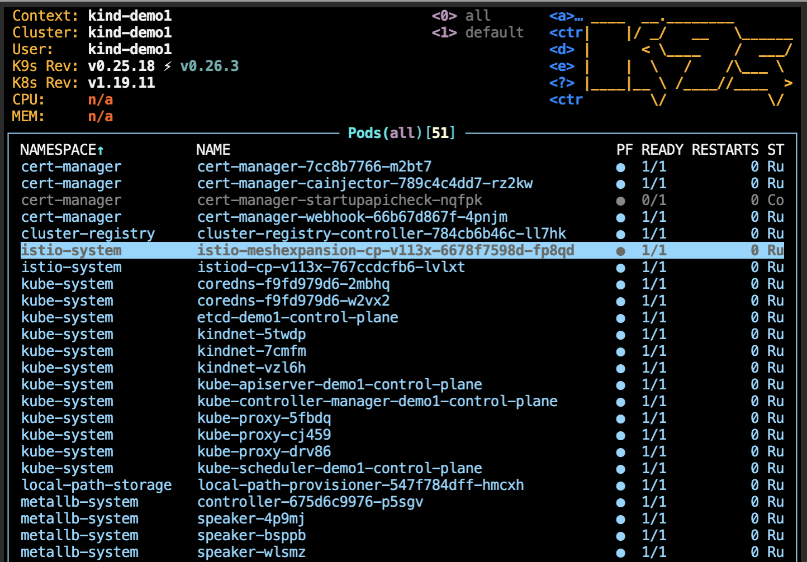
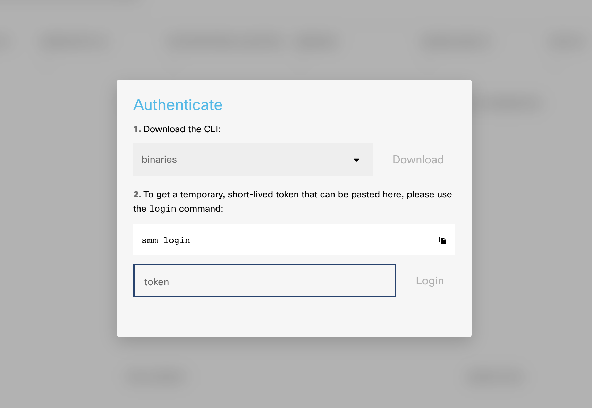

Welcome to the Calisti Webinar - learn to deploy, manage and troubleshoot your service mesh.


# Getting started

A service mesh provides many benefits to Cloud Native applications, including observability, security, and load-balancing. However, mesh architectures present operators with several inherent challenges including lifecycle management, fragmented observability, and the complexity of enabling advanced use-cases, such as canary deployments, customized traffic management and circuit breakers.

Calisti is a multi and hybrid-cloud enabled service mesh platform for constructing modern applications. Built on Kubernetes, and our Istio operator, Calisti enables flexibility, portability and consistency across on-prem data centres and cloud environments. Calisti operationalizes the service mesh to bring deep observability, convenient management, and policy-based security to modern container & virtual machine-based applications.

Calisti includes Prometheus to ensure faster troubleshooting and recovery. It supports distributed tracing via Jeager which is installed automatically by default when installing Calisti. 

Upon completion of this lab, you will be able to: 

•	Deploy the Istio service mesh using Calisti – The Cisco Service Mesh Manager 

•	Deploy a demo application in the service mesh

•	Observe, monitor and manage traffic across various microservices

•	Debug and troubleshoot issues in your service

•	Configure an ingress proxy for a custom service

## Create a 3 node cluster
To setup the k8s cluster execute the following in the terminal.

```bash
/home/ubuntu/lab/cluster/cluster_setup.sh
```

This sets up a 3 node cluster with metallb as the k8s load-balancer controller in around 3-4 minutes.

### Kubernetes Checks

To check the status of the Kubernetes cluster, do the following:

Verify the cluster exists.  Expected output should show the `demo1` cluster.

```bash
kind get clusters
```
Get the list of nodes in the cluster. We should have 3.

```bash
kind get nodes --name demo1
```

Check the status of the pods running in the cluster.  All pods should be in "Running" state.

```bash
kubectl get pods -A
```


## Deploy Calisti

Navigate to https://calisti.app. Click on the “Sign up, It’s Free” button and proceed to register and download the Calisti binaries (Note: for simplicity, the smm binary is already copied in your lab environment)


Extract the smm binary and copy to the system path
```bash
tar -xvf /home/ubuntu/lab/software/smm/smm_1.10.0_linux_amd64.tar.gz
sudo mv ./smm /usr/bin
```

Please copy and paste the activation credentials command provided on the download page to the terminal.


Install Calisti and expose dashboard (the installation will take around 5 min)
```bash
smm --non-interactive install -a --additional-cp-settings /home/ubuntu/lab/config/smm/enable-dashboard-expose.yaml -c ~/.kube/demo1.kconf
```

After the installation finishes you can check the Calisti SMM cluster status:

```bash
smm istio cluster status -c ~/.kube/demo1.kconf
```

The expected output should show something similar to this:

```
developer:src > smm istio cluster status -c ~/.kube/demo1.kconf
✓ validate-kubeconfig ❯ checking cluster reachability...
Clusters
---
Name        Type   Provider  Regions  Version   Distribution  Status  Message  
kind-demo1  Local  kind      []       v1.19.11  KIND          Ready            


ControlPlanes
---
Cluster     Name                   Version  Trust Domain     Pods                                             Proxies  
kind-demo1  cp-v113x.istio-system  1.13.5   [cluster.local]  [istiod-cp-v113x-767ccdcfb6-8zz7g.istio-system]  22/22 
```

Please wait to have all the Pods in Running or Completed status

```bash
kubectl get pods -A
```

You can also have an overview of the cluster using k9s - a terminal based UI to interact with your Kubernetes cluster.

```bash
k9s
```


(press Ctrl+c to exit)

## Calisti dashboard

Service Mesh Manager provides a dashboard interface that can be used to diagnose any issues with the underlying deployment.

In order to be able to access the Calisti dashboard outside of the lab container we need to enable a reverse-proxy 
```bash
/home/ubuntu/lab/config/smm/proxy.sh
```

For authenticating to the dashboard we will need an authentication token which is generated using the smm login command

```bash
smm login
```

Please copy the generated token and paste in the dedicated field when opening the [dashboard](http://location.hostname:8080) in your browser. Note that the token has a limited validity in time, so if you encounter any errors please re-generate & retry.



## Deploy the demo app
The Calisti dashboard, as you may have noticed, looks rather empty at this point. This is because we have not deployed any applications to the default namespace. 


Let us proceed to deploy a demo application and see how the system behaves.

```bash
smm demoapp install
```

Go back to the SMM dashboard and check that the pods and workloads are running. select the smm-demo namespace. (refresh the page if the new deployed namespaces are not yet shown)


