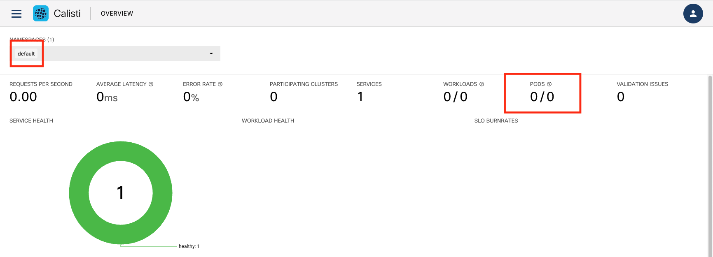
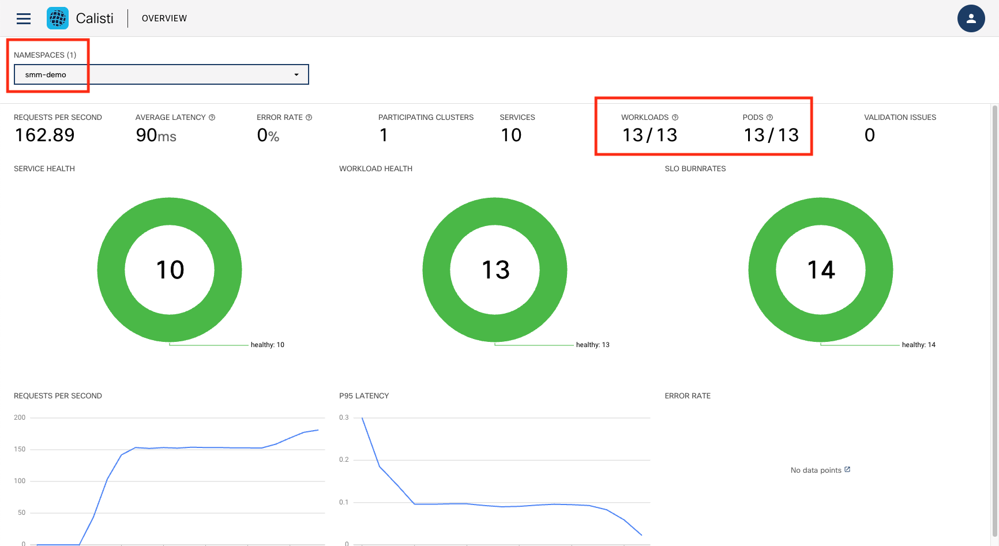

# Getting started

Welcome to the Calisti Webinar - learn to deploy, manage and troubleshoot your service mesh.


## Scenario

A service mesh provides many benefits to Cloud Native applications, including observability, security, and load-balancing. However, mesh architectures present operators with several inherent challenges including lifecycle management, fragmented observability, and the complexity of enabling advanced use-cases, such as canary deployments, customized traffic management and circuit breakers.

Calisti is a multi and hybrid-cloud enabled service mesh platform for constructing modern applications. Built on Kubernetes, and our Istio operator, Calisti enables flexibility, portability and consistency across on-prem data centres and cloud environments. Calisti operationalizes the service mesh to bring deep observability, convenient management, and policy-based security to modern container & virtual machine-based applications.

Calisti includes Prometheus to ensure faster troubleshooting and recovery. It supports distributed tracing via Jeager which is installed automatically by default when installing Calisti. 

Upon completion of this lab, you will be able to: 

•	Deploy the Istio service mesh using Calisti – The Cisco Service Mesh Manager 

•	Deploy a demo application in the service mesh

•	Observe and monitor traffic across various microservices of the demo application

•	Debug and troubleshoot issues in your service 

## Create a 3 node cluster
To setup the k8s cluster execute the following in the terminal.

```bash
/home/developer/tools/cluster/cluster_setup.sh
```

This sets up a 3 node cluster with metallb as the k8s load-balancer controller in around 3-4 minutes.

### Kubernetes Checks

To check the status of the Kubernetes cluster, do the following:

Verify the cluster exist.  Expected output should show the `demo1` cluster.

   ```bash
   kind get clusters
   ```
   
Check the status of the pods running in the cluster.  All pods should be in "Ready" state.

   ```bash
   kubectl get pods -A
   ```


## Deploy Calisti

Navigate to https://calisti.app. Click on the “Sign up, It’s Free” button and proceed to register and download the Calisti binaries.


For simplicity, the smm binary is already copied in your lab environment

Extract the smm binary and copy to the system path
```bash
tar -xvf /home/developer/bin-rel/smm/smm_1.10.0_linux_amd64.tar.gz 
cp ./smm /usr/bin
```

Please copy and paste the activation credentials command provided on the download page to the terminal.


Install Calisti and expose dashboard
```bash
smm --non-interactive install -a --anonymous-auth --additional-cp-settings /home/developer/tools/smm/enable-dashboard-expose.yaml -c ~/.kube/demo1.kconf
```

After the instalation finishes you can check the Calisti SMM cluster status:

```bash
smm istio cluster status -c ~/.kube/demo1.kconf
```

The expected output should show something similar to this:

```
developer:src > smm istio cluster status -c ~/.kube/demo1.kconf
✓ validate-kubeconfig ❯ checking cluster reachability...
Clusters
---
Name        Type   Provider  Regions  Version   Distribution  Status  Message  
kind-demo1  Local  kind      []       v1.19.11  KIND          Ready            


ControlPlanes
---
Cluster     Name                   Version  Trust Domain     Pods                                             Proxies  
kind-demo1  cp-v113x.istio-system  1.13.5   [cluster.local]  [istiod-cp-v113x-767ccdcfb6-8zz7g.istio-system]  22/22 
```

In order to be able to access the Calisti dashboard outside of the lab container we need to enable a reverse-proxy 
```bash
/home/developer/tools/proxy/proxy.sh
```


Now you should be able to open the [dashboard](dashboard) in your browser.


## Deploy the demo app
The Calisti dashboard, as you may have noticed, looks rather empty at this point. This is because we have not deployed any applications to the default namespace. 




Let us proceed to deploy a demo application and see how the system behaves.
```bash
smm demoapp install
```

Go back to the SMM dashboard in the Windows workstation, and check that the pods and workloads are running




Now click on the menu icon at the top left and select the TOPOLOGY view.


Observe the demo application shown in the TOPOLOGY view. Note that it is running in the smm-demo namespace.


Zoom into the topology by clicking on it and observe the various microservices in the demo application:

•	The frontpage microservice calls bookings, catalog and postgresql microservices to populate the page

•	The bookings microservice calls the analytics and payments microservices 

•	The payments microservice calls the notifications microservice

•	The catalog microservice calls the movie microservices.

•	There are 3 versions of the catalog microservice with version2 using mysql and version3 using a different database

The nodes in the graph are services or workloads, while the arrows represent network connections between different services. This is based on Istio metrics retrieved from Prometheus. You can click and zoom into the services and note how the traffic protocols along with the rps (requests per second) are also shown in the topology view.


SMM is also able to show the details for services such as MySQL and Postgresql – these metrics are not available in Istio and is a value-add provided by SMM. Click on the postgresql service and in the pop-up window, scroll down to note how it shows the details such as SQL transactions per second, etc.  


## Expose an application using istio GW


