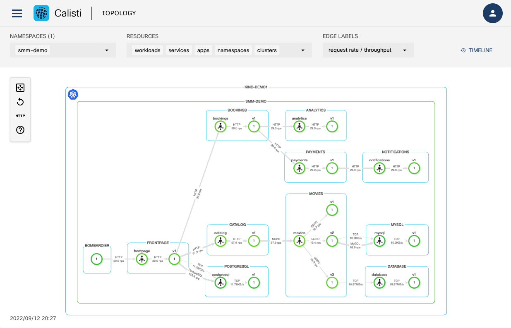
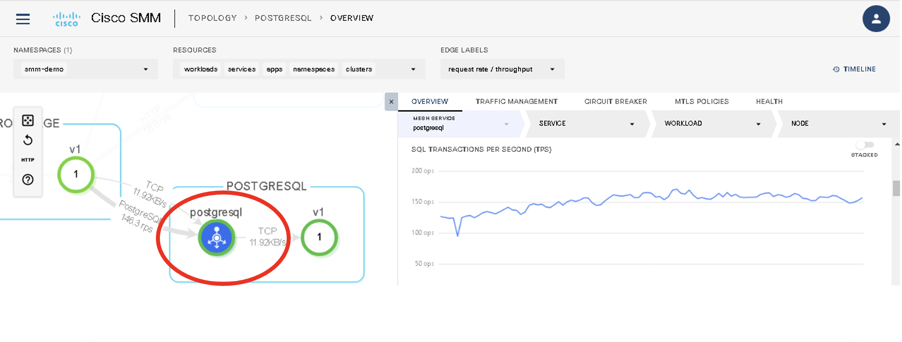
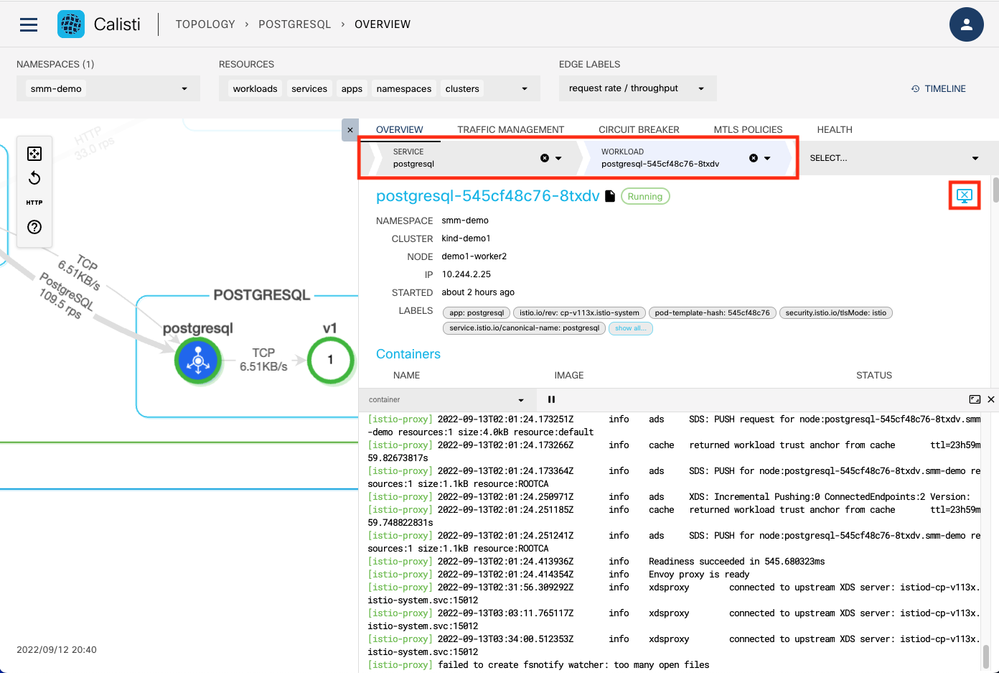
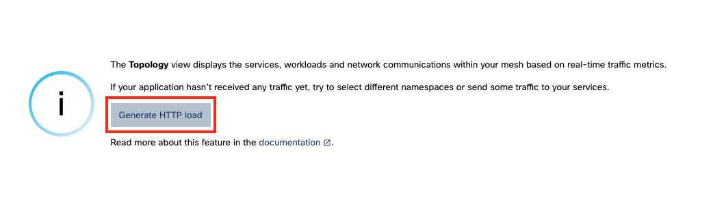
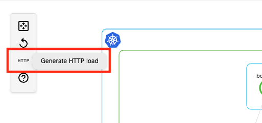
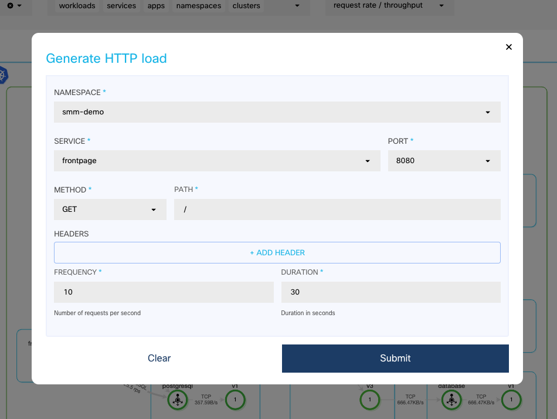
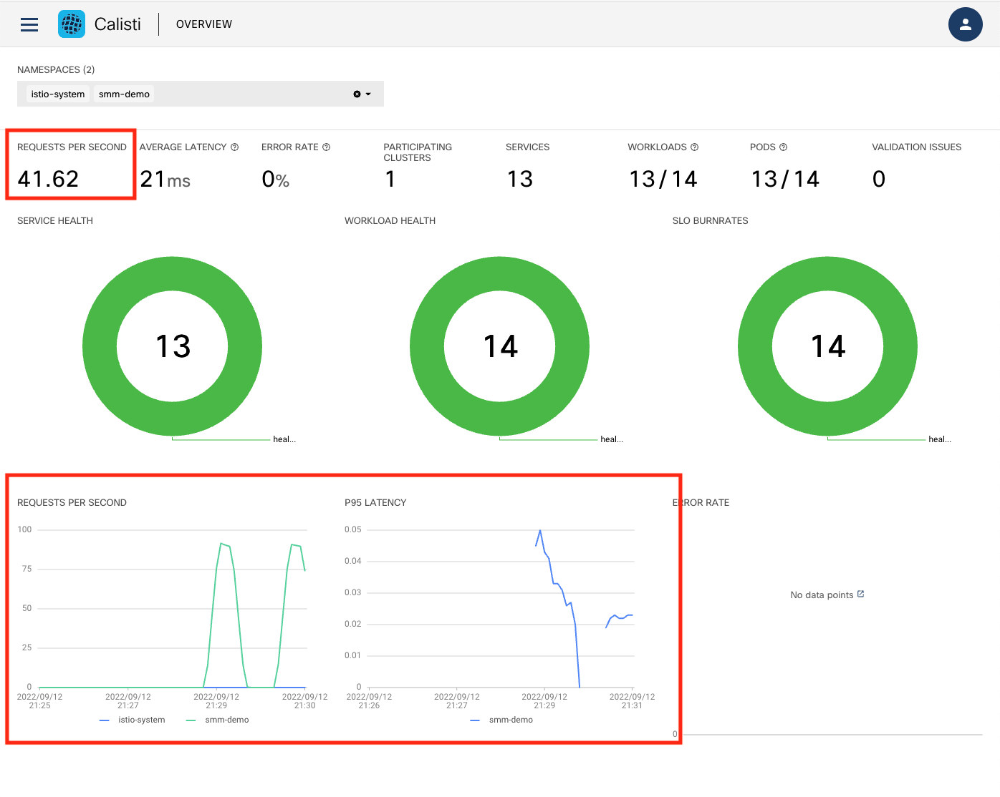

# Visualize your mesh

## Topolgy 

The TOPOLOGY page of the Service Mesh Manager web interface displays the topology of services and workloads inside the mesh, and annotates it with real-time information about latency, throughput, or HTTP request failures. You can also display historical data by adjusting the timeline.

The topology view is almost entirely based on metrics: metrics received from Prometheus and enhanced with information from Kubernetes.

The topology page serves as a starting point of diagnosing problems within the mesh. Service Mesh Manager is integrated with Grafana and Jaeger for easy access to in-depth monitoring and distributed traces of various services.

Select the smm-demo namespace and display its topolgy.



The nodes in the graph are services or workloads, while the arrows represent network connections between different services. This is based on Istio metrics retrieved from Prometheus. You can click and zoom into the services and note how the traffic protocols along with the requests per second(RPS) are also shown in the topology view.

We can easily observe the various microservices in the demo application:

•	The frontpage microservice calls bookings, catalog and postgresql microservices to populate the page

•	The bookings microservice calls the analytics and payments microservices 

•	The payments microservice calls the notifications microservice

•	The catalog microservice calls the movie microservices.

•	There are 3 versions of the catalog microservice with version2 using mysql and version3 using a different database


Calisti is also able to show the details for services such as MySQL and Postgresql – these metrics are not available in Istio and is a value-add provided by Calisti. Click on the postgresql service and in the pop-up window, scroll down to note how it shows the details such as SQL transactions per second, etc.  




Select one node in the graph (for example the postgresql service) and display its details. By drilling down and selecting the pod it is also possible to display its logs directly in the dashboard (click on the  icon)



## Generate traffic load


Most of the data displayed and the features provided in the Calisti interface is based on anaylsing the traffic received by the different applications in the cluster. Calisti provides several mechanisms to generate traffic.

If there is no traffic generated, the topolgy cannot be displayed and an option to generate traffic is displayed instead.



If the topology is displayed, triggering the traffic generation can be done using the HTTP button on the left



Let's generate some traffic on the frontend service from the smm-demo namespace.



Going back to the overview page of the dashboard we can now see the traffic increasing.



For the demoapp application constant traffic can also be generated using the CLI. (already started when deployed, no need to start again)

Start with

```
smm demoapp load start
```

and stop with

```
smm demoapp load stop
```


