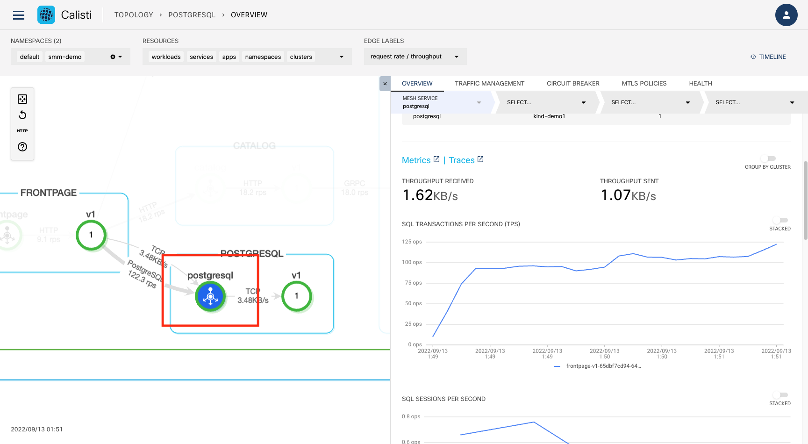

# Visualise your mesh

## Topolgy 

The TOPOLOGY page of the Service Mesh Manager web interface displays the topology of services and workloads inside the mesh, and annotates it with real-time information about latency, throughput, or HTTP request failures. You can also display historical data by adjusting the timeline.

The topology view is almost entirely based on metrics: metrics received from Prometheus and enhanced with information from Kubernetes.

The topology page serves as a starting point of diagnosing problems within the mesh. Service Mesh Manager is integrated with Grafana and Jaeger for easy access to in-depth monitoring and distributed traces of various services.

Select the smm-demo namespace and display its topolgy.


The nodes in the graph are services or workloads, while the arrows represent network connections between different services. This is based on Istio metrics retrieved from Prometheus. You can click and zoom into the services and note how the traffic protocols along with the rps (requests per second) are also shown in the topology view.

For certain services like MySQL and PostgreSQL, protocol-specific metrics normally not available in Istio are also shown, for example, sessions or transactions per second.

We can easily observe the various microservices in the demo application:

•	The frontpage microservice calls bookings, catalog and postgresql microservices to populate the page

•	The bookings microservice calls the analytics and payments microservices 

•	The payments microservice calls the notifications microservice

•	The catalog microservice calls the movie microservices.

•	There are 3 versions of the catalog microservice with version2 using mysql and version3 using a different database


Calisti is also able to show the details for services such as MySQL and Postgresql – these metrics are not available in Istio and is a value-add provided by Calisti. Click on the postgresql service and in the pop-up window, scroll down to note how it shows the details such as SQL transactions per second, etc.  




Select one node in the graph (for example the postgresql service) and display its details. By drilling down and selecting the pod it is also possible to display its logs directly in the dashboard (click on the  icon)


## Generate traffic load


Most of the data displayed and the fetures provided in the Calisti interface is based on anaylsing the traffic received by the different applications in the cluster. Calisti provides several mechanisms to generate traffic.

If there is no traffic generated, the topolgy cannot be displayed and an option to generate traffic is displayed instead.


If the topology is displayed, triggering the traffic generation can be done using the HTML button on the left


Let's generate some traffic on the frontend service from the smm-demo namespace.


Going back to the overview page of the dashboard we can now see the traffic increasing.


For the demoapp application constant traffic can also be generated using the CLI. 

Start with

```bash
smm demoapp load start
```

and stop with

```bash
smm demoapp load stop
```

## Traffic tap

The traffic tap feature of Service Mesh Manager enables you to monitor live access logs of the Istio sidecar proxies. Each sidecar proxy outputs access information for the individual HTTP requests or HTTP/gRPC streams.

The access logs contain information about the:

reporter proxy,
source and destination workloads,
request,
response, as well as the
timings.

### Traffic tap using the CLI

To watch the access logs for an individual namespace, workload or pod, use the smm tap command. Be sure to have some live traffic generated using any of the previous methods for this to work.

For smm-demo namespace

```bash
smm tap ns/smm-demo
```

The output should be similar to


It is also possible to filter on workload

```bash
smm tap --ns smm-demo workload/bookings-v1
```


and also use filter tags to only display the relevant lines like

```bash
smm tap ns/smm-demo --method GET --response-code 500,599
```

### Traffic tap using the UI

The functionality is also available in the UI, including setting the different filters.


Calisti also provides distributed  tracin - the process of tracking individual requests throughout their whole call stack in the system.

With distributed tracing in place it is possible to visualize full call stacks, to see which service called which service, how long each call took and how much were the network latencies between them. It is possible to tell where a request failed or which service took too much time to respond.
To collect and visualize this information Istio comes with tools like Jaeger which is installed automatically by default when installing Service Mesh Manager.

The demo application uses golang services which are configured to propagate the necessary tracing headers.

When load is sent to the application then traces can be perceived right away.
Jaeger is exposed through an ingress gateway and the links are present on the UI (both on the graph and list view).
When load is sent to the application then traces can be perceived right away.
Jaeger is exposed through an ingress gateway and the links are present on the UI (both on the graph and list view).


In the Jaeger UI you can see the whole call stack in the microservices architecture. You can see when exactly the root request was started and how much each request took.


