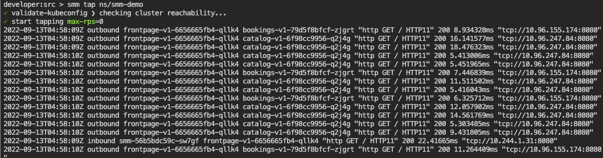
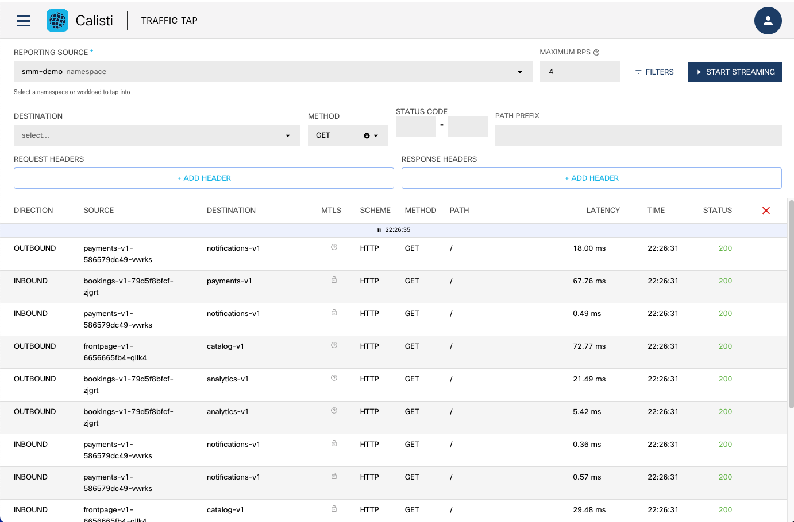
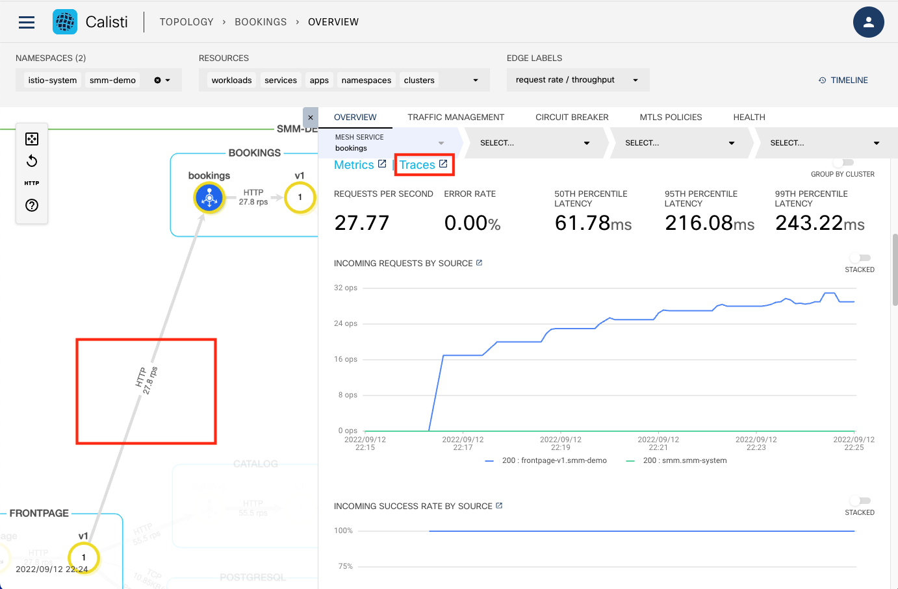
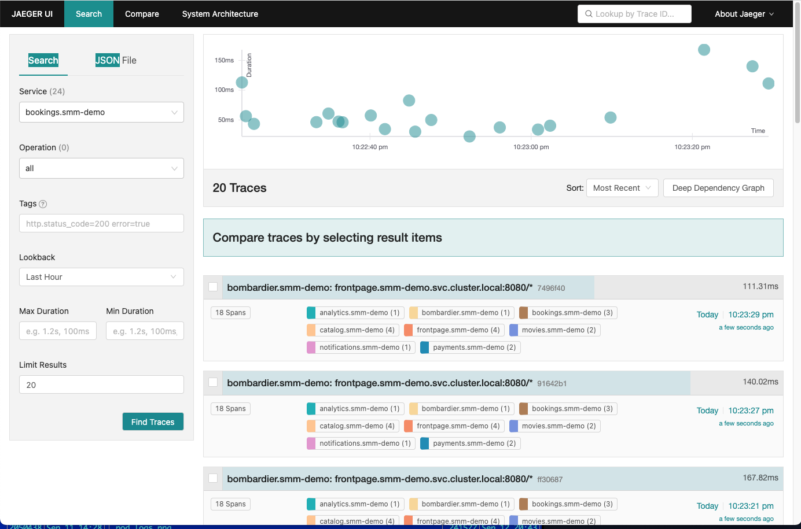
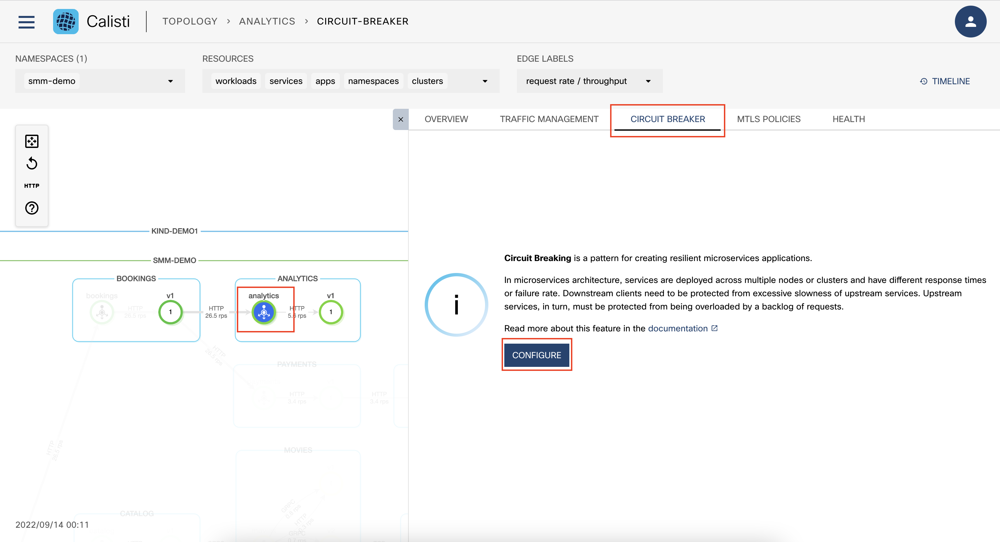
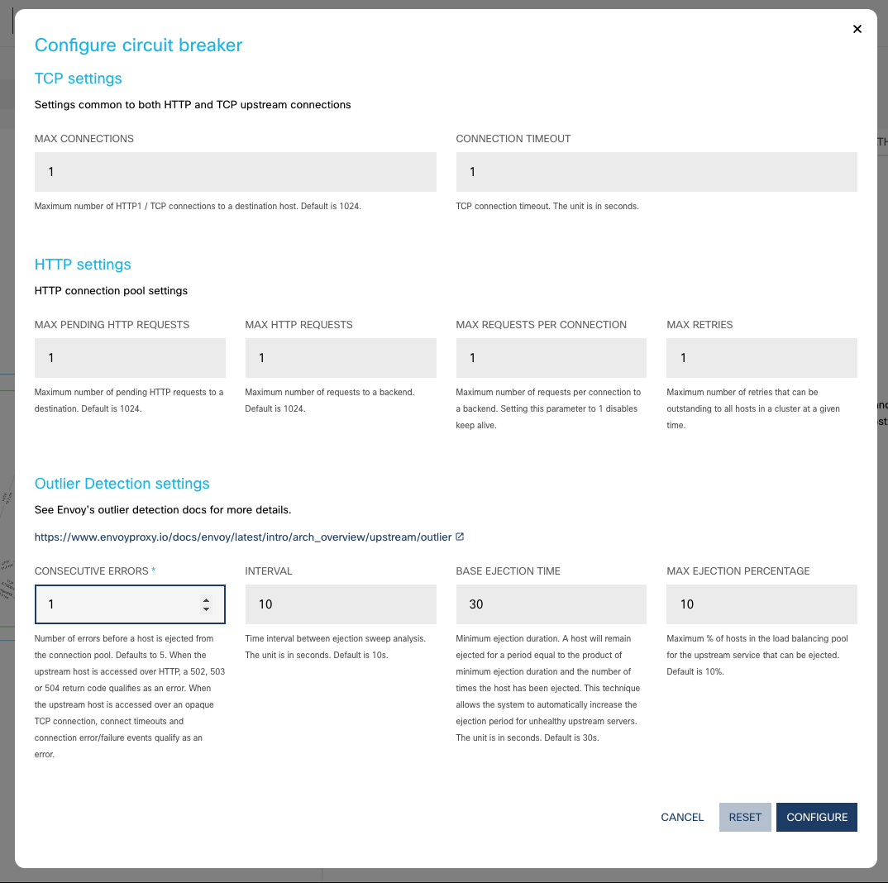
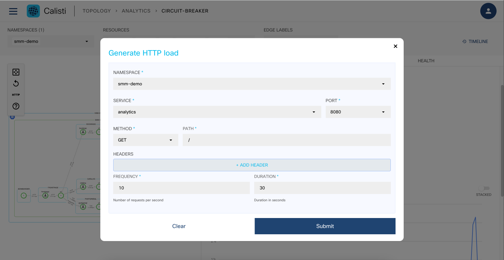
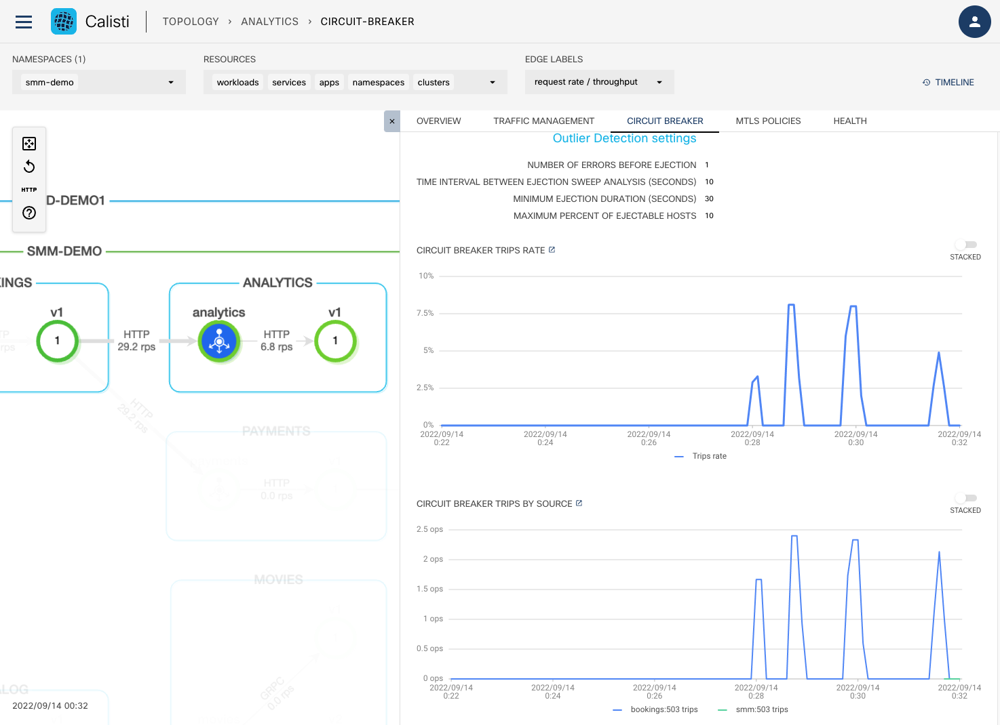
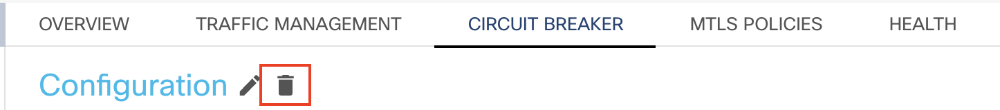

# Traffic management

## Traffic tap

The traffic tap feature of Service Mesh Manager enables you to monitor live access logs of the Istio sidecar proxies. Each sidecar proxy outputs access information for the individual HTTP requests or HTTP/gRPC streams.

The access logs contain information about the: reporter proxy, source and destination workloads, request, response, as well as the timings.

### Traffic tap using the CLI

To watch the access logs for an individual namespace, workload/pod, use the smm tap command. Be sure to have some live traffic generated using any of the previous methods for this to work.

For smm-demo namespace

```bash
smm tap ns/smm-demo
```

Press Ctrl+C in the terminal to stop. The output should be similar to



It is also possible to filter on workload

```bash
smm tap --ns smm-demo workload/bookings-v1
```


and also use filter tags to only display the relevant lines like

```bash
smm tap ns/smm-demo --method GET --response-code 500,599
```

### Traffic tap using the UI

The functionality is also available in the UI, including setting the different filters.



Calisti also provides distributed tracing - the process of tracking individual requests throughout their whole call stack in the system.

With distributed tracing in place it is possible to visualize full call stacks, to see which service called which service, how long each call took and how much were the network latencies between them. It is possible to tell where a request failed or which service took too much time to respond.
To collect and visualize this information Istio comes with tools like Jaeger which is installed automatically by default when installing Service Mesh Manager.

The demo application uses golang services which are configured to propagate the necessary tracing headers.

Once load is sent to the application, traces can be perceived right away.
Jaeger is exposed through an ingress gateway and the links are present on the UI (both on the graph and list view). 




In the Jaeger UI you can see the whole call stack in the microservices architecture. You can see when exactly the root request was started and how much each request took. 




## Circuit breaking

Circuit Breaking is a pattern for creating resilient microservices applications. In microservices architecture, services are deployed across multiple nodes or clusters and have different response times or failure rate. Downstream clients need to be protected from excessive slowness of upstream services. Upstream services, in turn, must be protected from being overloaded by a backlog of requests.

A circuit breaker can have three states:

**Closed**: requests succeed or fail until the number of failures reach a predetermined threshold, with no interference from the breaker. When the threshold is reached, the circuit breaker opens.

**Open**: the circuit breaker trips the requests, which means that it returns an error without attempting to execute the call

**Half open**: the failing service is given time to recover from its broken behavior. If requests continue to fail in this state, then the circuit breaker is opened again and keeps tripping requests. Otherwise, if the requests succeed in the half open state, then the circuit breaker will close and the service will be allowed to handle requests again.


Service Mesh Manager is using Istio’s - and therefore Envoy’s - circuit breaking feature under the hood.

Let's configure a circuit breaker for a service. In the topology select the analytics service, select the CIRCUIT BREAKER tab and then Configure.



In order to be able to see immediate results of the Circuit Breaker activation, configure it with the with the following values:
- TCP settings
  - MAX CONNECTIONS: 1
  - CONNECTION TIMEOUT: 1
- HTTP settings
  - MAX PENDING HTTP REQUESTS: 1
  - MAX HTTP REQUESTS: 1
  - MAX REQUESTS PER CONNECTION: 1
  - MAX RETRIES: 1
- Outlier Detection settings
  - CONSECUTIVE ERRORS: 1
  - INTERVAL: 10
  - VASE EJECTION TIME: 10
  - MAX EJECTION PERCENTAGE: 1



Generate some additional load on the analytics service.



When traffic begins to flow the circuit breaker starts to trip requests. In the Service Mesh Manager UI, you can see two live Grafana dashboards which specifically show the circuit breaker trips and help you learn more about the errors involved.

The first dashboard details the percentage of total requests that were tripped by the circuit breaker. When there are no circuit breaker errors, and your service works as expected, this graph shows 0%. Otherwise, it shows the percentage of the requests that were tripped by the circuit breaker.

The second dashboard provides a breakdown of the trips caused by the circuit breaker by source. If no circuit breaker trips occurred, there are no spikes in this graph. Otherwise, it shows which service caused the circuit breaker to trip, when, and how many times. Malicious clients can be tracked by checking this graph.



To remove circuit breaking select the Delete icon in the top of the CIRCUIT BREAKER page.




## Fault injection

Fault injection is a system testing method which involves the deliberate introduction of network faults and errors into a system. It can be used to identify design or configuration weaknesses, and to ensure that the system can handle faults and recover from error conditions.

With Service Mesh Manager, you can inject failures at the application layer to test the resiliency of the services. You can configure faults to be injected into requests that match specific conditions to simulate service failures and higher latency between services. There are two types of failures:

**Delay** adds a time delay before forwarding the requests, emulating various failures such as network issues, an overloaded upstream service, and so on.

**Abort** aborts the HTTP request attempts and returns error codes to a downstream service, giving the impression that the upstream service is faulty.

Service Mesh Manager uses Istio’s (Envoy) fault injection feature under the hood.

Create a new traffic route rule in the Traffic Management menu of the selected topology node.


Set the Following values
- PORT NUMBER: 8080
- FAULT INJECTION:
  - DELAY PERCENTAGE: 50
  - ABORT PERCENTAGE: 40
  - FIXED DELAY: 3s
  - ABORT HTTP STATUS CODE: 503


Click Apply and check the status in the Topology page as the result of the injected faults


## Ingress Gateway

 Gateways are to manage inbound and outbound traffic for your mesh, letting you specify which traffic you want to enter or leave the mesh. Gateway configurations are applied to standalone Envoy proxies that are running at the edge of the mesh, rather than sidecar Envoy proxies running alongside your service workloads. 
 Ingress gateways define an entry point into your Istio mesh for incoming traffic.


```bash
cat > echo.yaml <<EOF
apiVersion: apps/v1
kind: Deployment
metadata:
  name: echo
  labels:
    k8s-app: echo
  namespace: default
spec:
  replicas: 1
  selector:
    matchLabels:
      k8s-app: echo
  template:
    metadata:
      labels:
        k8s-app: echo
    spec:
      terminationGracePeriodSeconds: 2
      containers:
      - name: echo-service
        image: k8s.gcr.io/echoserver:1.10
        ports:
        - containerPort: 8080
---
apiVersion: v1
kind: Service
metadata:
  name: echo
  labels:
    k8s-app: echo
  namespace: default
spec:
  ports:
  - name: http
    port: 80
    targetPort: 8080
  selector:
    k8s-app: echo
EOF
kubectl apply -f echo.yaml
```

Create a new ingress gateway using the IstioMeshGateway resource. Calisti creates a new ingress gateway deployment and a corresponding service, and automatically labels them with the gateway-name and gateway-type labels and their corresponding values.
IstioMeshGateway is a custom Istio operator as defined by SMM that allows to easily setup multiple gateways in a cluster.

```bash
cat > meshgw.yaml <<EOF
apiVersion: servicemesh.cisco.com/v1alpha1
kind: IstioMeshGateway
metadata:
  name: demo-gw
spec:
  istioControlPlane:
    name: cp-v113x
    namespace: istio-system
  runAsRoot: false
  service:
    ports:
      - name: tcp-status-port
        port: 15021
        protocol: TCP
        targetPort: 15021
      - name: http
        port: 80
        protocol: TCP
        targetPort: 8080
    type: LoadBalancer
  type: ingress 
EOF
kubectl apply -f meshgw.yaml
```

Get the IP address of the gateway.

```bash
kubectl -n default get istiomeshgateways demo-gw
```

Create the Gateway and VirtualService resources to configure listening ports on the matching gateway deployment. Virtual Service defines a set of traffic routing rules to apply when a host is addressed. Each routing rule defines matching criteria for traffic of a specific protocol. If the traffic is matched, then it is sent to a named destination service.
The hosts fields should point to the external hostname of the service. (for testing purposes we are using nip.io, which is a domain name that provides wildcard DNS for any IP address.)

```bash
cat > gw_vs.yaml <<EOF
apiVersion: networking.istio.io/v1alpha3
kind: Gateway
metadata:
  name: echo
  namespace: default
spec:
  selector:
    gateway-name: demo-gw
    gateway-type: ingress
  servers:
  - port:
      number: 80
      name: http
      protocol: HTTP
    hosts:
    - "echo.172.19.250.3.nip.io"
---
apiVersion: networking.istio.io/v1alpha3
kind: VirtualService
metadata:
  name: echo
  namespace: default
spec:
  hosts:
  - "echo.172.19.250.3.nip.io"
  gateways:
  - echo 
  http:
  - route:
    - destination:
        port:
          number: 80
        host: echo.default.svc.cluster.local
EOF
kubectl apply -f gw_vs.yaml
```
Access the service on the external address.


```bash
/home/ubuntu/lab/gw/access_gw.sh
```

The script is making a curl request to echo.172.19.250.3.nip.io and should be able to successfuly reach the echo service.
The expected result should be similar to:

```
HTTP/1.1 200 OK
date: Wed, 14 Sep 2022 07:44:57 GMT
content-type: text/plain
server: istio-envoy
x-envoy-upstream-service-time: 0
transfer-encoding: chunked


Hostname: echo-7ffdff66-86dvs

Pod Information:
        -no pod information available-

Server values:
        server_version=nginx: 1.13.3 - lua: 10008

Request Information:
        client_address=10.244.1.31
        method=GET
        real path=/
        query=
        request_version=1.1
        request_scheme=http
        request_uri=http://echo.172.19.250.3.nip.io:8080/

Request Headers:
        accept=*/*
        host=echo.172.19.250.3.nip.io
        user-agent=curl/7.80.0
        x-b3-sampled=0
        x-b3-spanid=eceed2c536945ef6
        x-b3-traceid=0ed39aea7da454cceceed2c536945ef6
        x-envoy-attempt-count=1
        x-envoy-decorator-operation=echo.default.svc.cluster.local:80/*
        x-envoy-internal=true
        x-envoy-peer-metadata=ChQKDkFQUF9DT05UQUlORVJTEgIaAAoaCgpDTFVTVEVSX0lEEgwaCmtpbmQtZGVtbzEKGQoNSVNUSU9fVkVSU0lPThIIGgYxLjEzLjUK2wIKBkxBQkVMUxLQAirNAgoZCgxnYXRld2F5LW5hbWUSCRoHZGVtby1ndwoZCgxnYXRld2F5LXR5cGUSCRoHaW5ncmVzcwonCgxpc3Rpby5pby9yZXYSFxoVY3AtdjExM3guaXN0aW8tc3lzdGVtCiEKEXBvZC10ZW1wbGF0ZS1oYXNoEgwaCjVjNjhmZDZjZDkKHgoHcmVsZWFzZRITGhFpc3Rpby1tZXNoZ2F0ZXdheQosCh9zZXJ2aWNlLmlzdGlvLmlvL2Nhbm9uaWNhbC1uYW1lEgkaB2RlbW8tZ3cKLwojc2VydmljZS5pc3Rpby5pby9jYW5vbmljYWwtcmV2aXNpb24SCBoGbGF0ZXN0CiEKF3NpZGVjYXIuaXN0aW8uaW8vaW5qZWN0EgYaBHRydWUKJwoZdG9wb2xvZ3kuaXN0aW8uaW8vbmV0d29yaxIKGghuZXR3b3JrMQoSCgdNRVNIX0lEEgcaBW1lc2gxCiIKBE5BTUUSGhoYZGVtby1ndy01YzY4ZmQ2Y2Q5LWprNmdrChYKCU5BTUVTUEFDRRIJGgdkZWZhdWx0CksKBU9XTkVSEkIaQGt1YmVybmV0ZXM6Ly9hcGlzL2FwcHMvdjEvbmFtZXNwYWNlcy9kZWZhdWx0L2RlcGxveW1lbnRzL2RlbW8tZ3cKFwoRUExBVEZPUk1fTUVUQURBVEESAioAChoKDVdPUktMT0FEX05BTUUSCRoHZGVtby1ndw==
        x-envoy-peer-metadata-id=router~10.244.1.31~demo-gw-5c68fd6cd9-jk6gk.default~default.svc.cluster.local
        x-forwarded-for=10.244.1.1
        x-forwarded-proto=http
        x-request-id=39e6de8f-65d1-4999-8431-10f8b5bcc95c

Request Body:
        -no body in request-
```