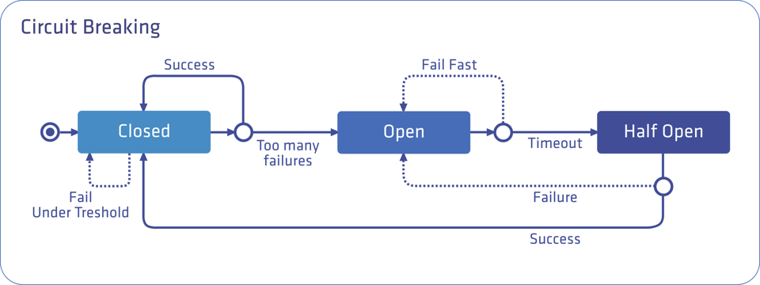
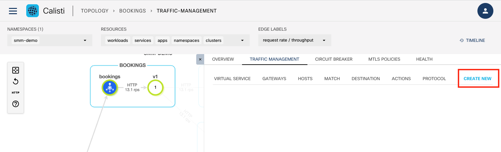
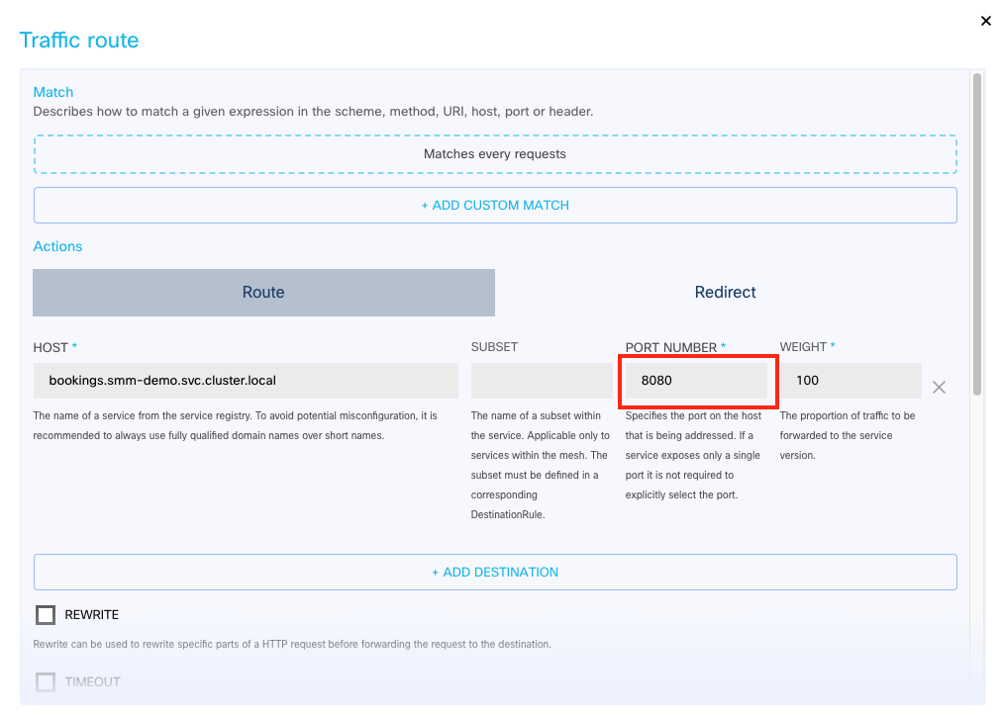
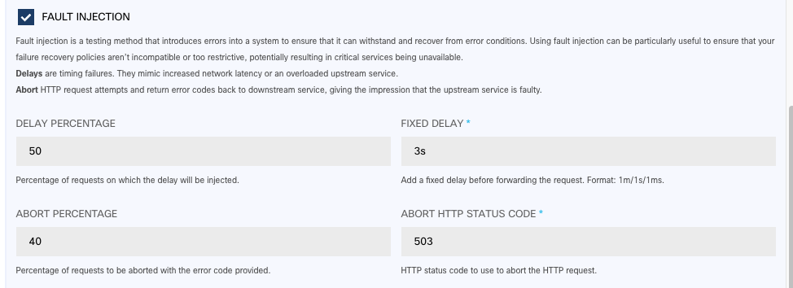
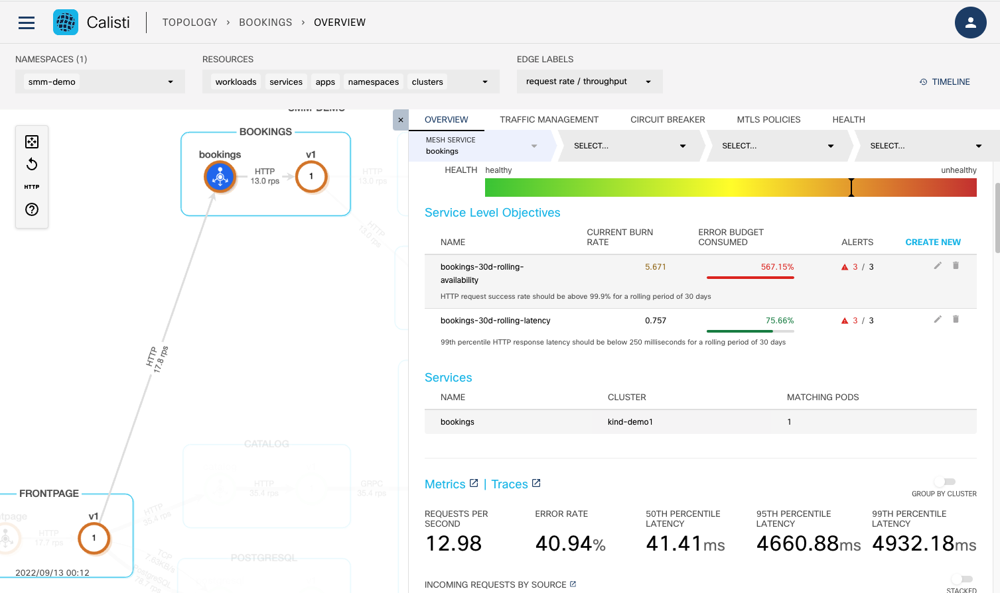
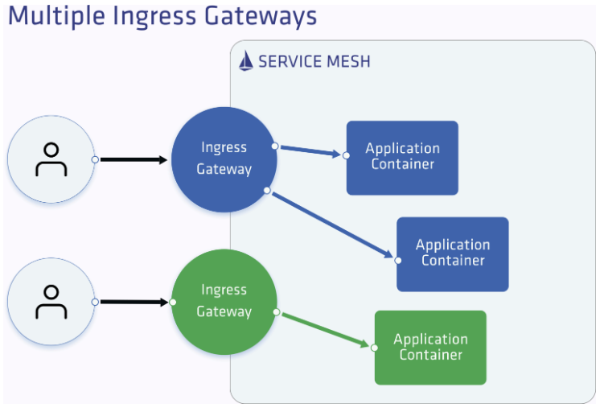

## Circuit breaking

Circuit Breaking is a pattern for creating resilient microservices applications. In microservices architecture, services are deployed across multiple nodes or clusters and have different response times or failure rate. Downstream clients need to be protected from excessive slowness of upstream services. Upstream services, in turn, must be protected from being overloaded by a backlog of requests.

A circuit breaker can have three states:

**Closed**: requests succeed or fail until the number of failures reach a predetermined threshold, with no interference from the breaker. When the threshold is reached, the circuit breaker opens.

**Open**: the circuit breaker trips the requests, which means that it returns an error without attempting to execute the call

**Half open**: the failing service is given time to recover from its broken behavior. If requests continue to fail in this state, then the circuit breaker is opened again and keeps tripping requests. Otherwise, if the requests succeed in the half open state, then the circuit breaker will close and the service will be allowed to handle requests again.



Service Mesh Manager is using Istio’s - and therefore Envoy’s - circuit breaking feature under the hood.


## Fault injection

Fault injection is a system testing method which involves the deliberate introduction of network faults and errors into a system. It can be used to identify design or configuration weaknesses, and to ensure that the system can handle faults and recover from error conditions.

With Service Mesh Manager, you can inject failures at the application layer to test the resiliency of the services. You can configure faults to be injected into requests that match specific conditions to simulate service failures and higher latency between services. There are two types of failures:

**Delay** adds a time delay before forwarding the requests, emulating various failures such as network issues, an overloaded upstream service, and so on.

**Abort** aborts the HTTP request attempts and returns error codes to a downstream service, giving the impression that the upstream service is faulty.

Service Mesh Manager uses Istio’s (Envoy) fault injection feature under the hood.

Create a new traffic route rule in the Traffic Management menu of the selected topology node.



Set the Following values
- PORT NUMBER: 8080
- FAULT INJECTION:
  - DELAY PERCENTAGE: 50
  - ABORT PERCENTAGE: 40
  - FIXED DELAY: 3
  - ABORT HTTP STATUS CODE: 503




Click Apply and check the status in the Topology page as the result of the injected faults



## Ingress Gateway

Ingress gateways define an entry point into your Istio mesh for incoming traffic.



```bash
cat > echo.yaml <<EOF
apiVersion: apps/v1
kind: Deployment
metadata:
  name: echo
  labels:
    k8s-app: echo
  namespace: default
spec:
  replicas: 1
  selector:
    matchLabels:
      k8s-app: echo
  template:
    metadata:
      labels:
        k8s-app: echo
    spec:
      terminationGracePeriodSeconds: 2
      containers:
      - name: echo-service
        image: k8s.gcr.io/echoserver:1.10
        ports:
        - containerPort: 8080
---
apiVersion: v1
kind: Service
metadata:
  name: echo
  labels:
    k8s-app: echo
  namespace: default
spec:
  ports:
  - name: http
    port: 80
    targetPort: 8080
  selector:
    k8s-app: echo
EOF
kubectl apply -f echo.yaml
```

Create a new ingress gateway using the IstioMeshGateway resource. Calisti creates a new ingress gateway deployment and a corresponding service, and automatically labels them with the gateway-name and gateway-type labels and their corresponding values.

```bash
cat > meshgw.yaml <<EOF
apiVersion: servicemesh.cisco.com/v1alpha1
kind: IstioMeshGateway
metadata:
  name: demo-gw
spec:
  istioControlPlane:
    name: cp-v113x
    namespace: istio-system
  runAsRoot: false
  service:
    ports:
      - name: tcp-status-port
        port: 15021
        protocol: TCP
        targetPort: 15021
      - name: http
        port: 80
        protocol: TCP
        targetPort: 8080
    type: LoadBalancer
  type: ingress 
EOF
kubectl apply -f meshgw.yaml
```

Get the IP address of the gateway.

```bash
kubectl -n default get istiomeshgateways demo-gw
```

Create the Gateway and VirtualService resources to configure listening ports on the matching gateway deployment. The hosts fields should point to the external hostname of the service. (for testing purposes we are using nip.io, which is a domain name that provides wildcard DNS for any IP address.)

```bash
cat > gw_vs.yaml <<EOF
apiVersion: networking.istio.io/v1alpha3
kind: Gateway
metadata:
  name: echo
  namespace: default
spec:
  selector:
    gateway-name: demo-gw
    gateway-type: ingress
  servers:
  - port:
      number: 80
      name: http
      protocol: HTTP
    hosts:
    - "echo.172.19.250.3.nip.io"
---
apiVersion: networking.istio.io/v1alpha3
kind: VirtualService
metadata:
  name: echo
  namespace: default
spec:
  hosts:
  - "echo.172.19.250.3.nip.io"
  gateways:
  - echo 
  http:
  - route:
    - destination:
        port:
          number: 80
        host: echo.default.svc.cluster.local
EOF
kubectl apply -f gw_vs.yaml
```
Access the service on the external address.

```bash
curl -i echo.172.19.250.3.nip.io
```
